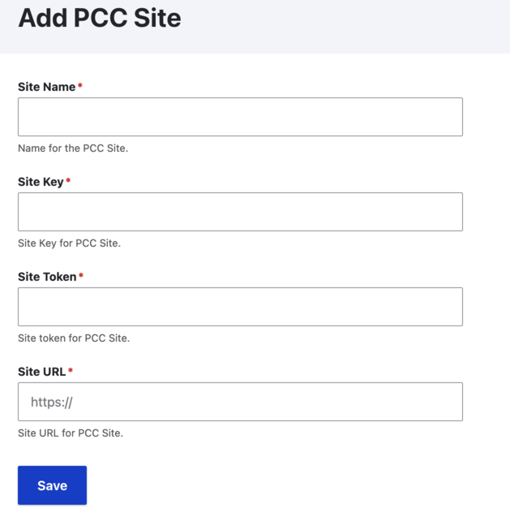
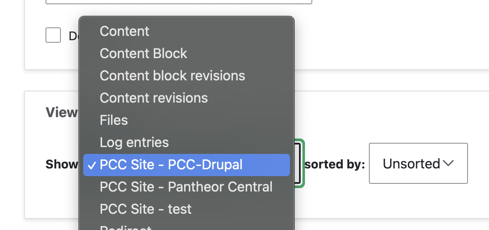

# ARCHIVED

This repository has been archived in favor of a substantially rewritten [integration module](https://www.drupal.org/project/pantheon_content_publisher).

---------------------

# PCX Connect | PCC Integration

Drupal Module for PCC Integration

## Pre-requisite

PCX Connect allows Drupal integration with multiple PCC Sites. As a pre-requisite, we need the following:

- PCC Site ID & Token
  (Refer to [Managing PCC Sites](#managing-pcc-sites) to know more about how to create a PCC site or access an existing site)

- Google Drive Integrated with Pantheon Content Cloud
  (Refer to [Content Creation Guide](https://pcc.pantheon.io/docs/pantheon-content-cloud-installation-instructions) to
connect Google with PCC Site)

## Managing PCC Sites

PCC Sites are managed by PCC Cli. Refer to [Pantheon Developer Guide](https://pcc.pantheon.io/docs/pcc-cli-setup) to 
setup `pcc-cli` and then we can create PCC Site(s). 

### Creating a PCC Site

1. Create a PCC Site using `pcc-cli` to get the site ID:

    ```pcc site create --url mydomain.com```

    And PCC Site Token as:

    ```pcc token create```

    More details here: [Pantheon Guide | PCC Variables](https://pcc.pantheon.io/docs/required-pcc-variables)

2. Once we have PCC Site ID & Token, we can create / manage Drupal PCC Site at `/admin/structure/pcc_sites`

    

**Note: For Reference, the PCX Connect module ships an example connected PCC Site.**

## Managing content display of PCC Site

Once the PCC Site is created and added in Drupal, we can display content from PCC Site (the connected Google Drive).

### Creating Listing of the content

To create a listing of the content from PCC site, create a view to show `PCC Site - Site Name`. We have the following
fields, filters, sorting and pagination available:



#### Available fields

- ID
- Slug
- Title
- Content
- Snippet
- Tags
- Metadata
- Published Date
- Updated At
- Publishing Level

#### Metadata fields

PCX Connect module also supports Metadata fields. Search for Metadata field, add the field, select one of the available
metadata fields.

#### Filtering, Sorting and Pagination

Following features are supported for views:

##### Filtering

Module supports Views content filtering for `Title`, `Content`, `Tags` fields for now. Additionally, usage is limited to
`is equal to` operator while it corresponds to search docs using `contains` operator via PCC API.

##### Sorting

Module supports Views content sorting for `Published Date` and `Updated At`.

##### Pagination

For now, the module supports Mini pager.

### Creating individual page for each content

This can be achieved using contextual filters.

#### Contextual Filter

Following contextual filters are fully supported that can help in building individual content pages:

- Slug
- ID

### Live Preview of content

PCX Connect module installs optionally `pantheon_cloud_api` view that creates route `/api/pantheoncloud/document/%` for
integration with Pantheon Content Cloud. This uses `Publishing Level` contextual filter. Preview supports auto-refresh.

## Smart Components Integration | PCC | Submodule

For integration with PCC Smart Components, please review and enable `pcx_smart_components` submodule.

## Examples

PCX Connect module by default would create PCC Site configuration for demo purposes. Additionally, View 
`blogs` and `pantheon_cloud_api` are installed, to show a sample content listing page at `/blogs` and also creates
individual pages (`/blogs/{slug}`) for these blog contents.

And the `pantheon_cloud_api` view is responsible for Live Preview feature.
