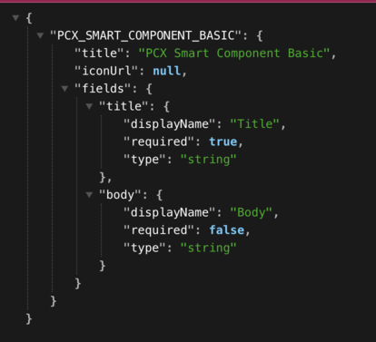

# Smart Components Integration | PCC

Pantheon Content Cloud supports custom components which actually are owned by Drupal (in our case), but available in
Google Docs to be added as content (via PCC Google Docs Add-on). Read More about [Smart Components](https://pcc.pantheon.io/docs/content-cloud-smart-custom-components)

## Managing Single Directory Component (SDC) as Smart Component

This module enables usage of Drupal Single Directory Components (SDC) to be integrated as PCC Smart Component. This
gives Drupal flexibility to define the component (properties, output, assets) while Google Docs can embed them as
content, and finally Drupal controls rendering of these components.

### Creating SDC (PCC Component)

Creating SDC for PCC Integration is simple, just set `pcc_component: true` for the component and these components, would
be available in Google Docs (via Add-on). A sample SDC component (PCX Smart Component Basic) is available with this 
module be default.

### Adding smart component to PCC Site Content (via Google Docs)

To ensure SDC components are available as smart component for Google Docs, validate following route
`/api/pantheoncloud/component_schema`

This list contains SDC as smart components that are available for Google Docs Add-on

### Rendering Smart Component

This module supports smart components in `pcc_content` views field and would automatically render the smart component
based on SDC rendering.

As of now, module supports the following SDC property types

- string
- boolean
- object
- number

Following properties have not been tested:

- array
- enum
